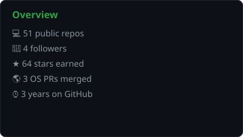
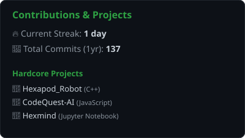
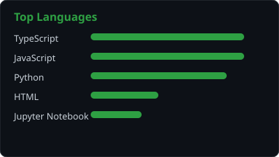
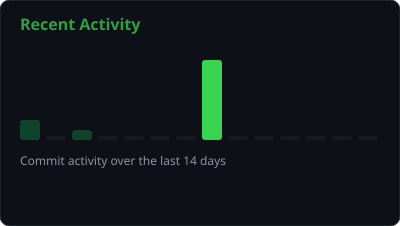

# 👋 About Me

Software engineer focused on debugging and AI evaluation task design — building the kind of hard, verifiable problems used to test whether AI coding agents actually reason or just pattern-match.

I contribute to **Project Dynamo** (Handshake AI), authoring terminal-based debugging and configuration-repair tasks: writing the bug, the reference solution, the hidden tests, and validating everything holds up in a fresh Docker environment before it ships.

My other edge is hardware. My capstone is a 25-DOF hexapod robot with wireless control and real-time inverse kinematics — which means I debug systems where a timing bug or a bad pointer causes a physical machine to fall over, not just fail a test. That root-cause instinct (is this a math error, a timing error, or a mechanical one — three failure modes that look identical from outside) carries directly into how I write and review software.

5× internships and contract roles. 500+ LeetCode problems solved. Real shipped code, not just tutorials.

- 🔧 At **Infosys Springboard**, built and delivered Java full-stack modules end-to-end.
- 🚀 At **CertifyO**, shipped features in a live platform used by real users.
- 🤖 At **Handshake AI (Project Dynamo)**, authored evaluation tasks used to benchmark frontier coding agents.

**Stack:** Python · Java · TypeScript · C · Linux · Docker · Git · React · Spring Boot · Node.js · PostgreSQL · MongoDB

---

## 💻 Tech Stack

---

## 📊 GitHub Stats

  
  

  
  

Self-hosted and auto-updated daily via GitHub Actions — see <code>.github/workflows/update-stats.yml</code>

